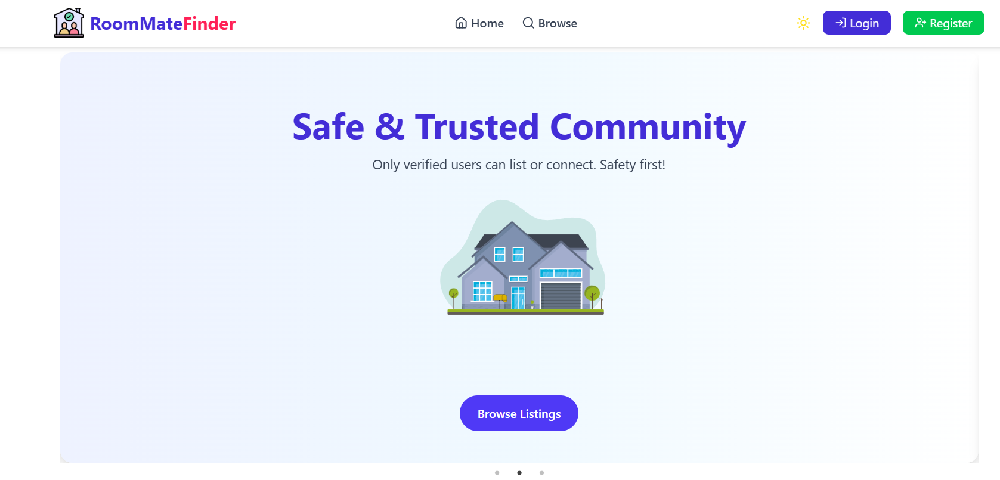

# 🏠 Roommate Finder Website
<p align="center">
  
</p>


A full-stack web application for finding and listing roommates with chat support.

🔗 **Live Link:** [[roommatefinder.vercel.app](https://roommatefinder.vercel.app)](https://roommate-finder-app-6340f.web.app/)

---

## 🛠️ Tech Stack
- React.js
- Node.js
- Express.js
- MongoDB
- Firebase Auth

---

## 🚀 Features
- User Authentication (Register/Login)
- Add, Browse, Like Roommate Listings
- Chat between users
- Dark/Light Theme toggle
- Protected Routes

---

## 📦 Dependencies
- React Router DOM
- Framer Motion
- Axios
- React Hook Form
- SweetAlert2

---

## 🖥️ Run Locally

```bash
git clone https://github.com/Raihan-143/roommate-finder.git
cd roommate-finder
npm install
npm run dev
